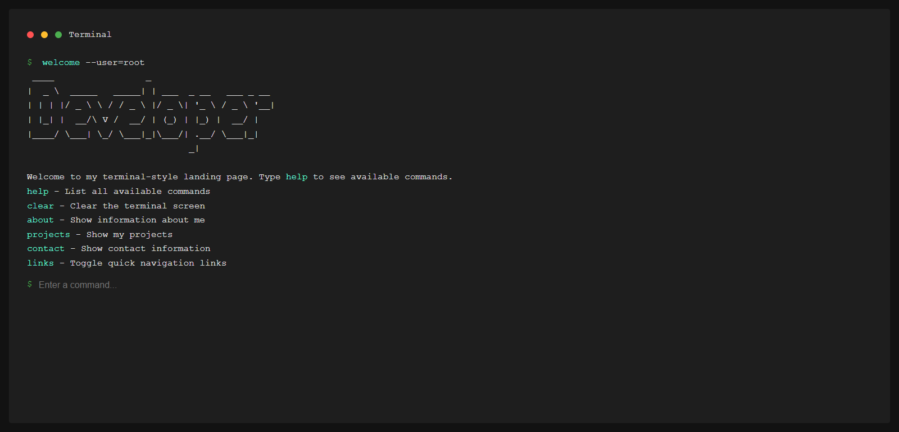

# 💻 Terminal Portfolio

This is a **Terminal Portfolio** project, where users can interact by typing commands into the terminal to get information about me, my projects, and contacts.

## 🚀 Technologies used
- **HTML, CSS, and JavaScript** → Structuring and styling of the interactive terminal.
- **DOM manipulation** → Dynamic display of messages and commands.
- **Git and GitHub** → Version control and repository hosting.

## Project Description
This is an HTML, CSS and JAVASCRIPT portfolio project that contains a brief description about me and the projects I have built so far.

## 📜 Available commands
Type the following commands to interact with the terminal:

| Comando      | Descrição |
|-------------|-----------|
| `help`      | List all available commands |
| `clear`     | Clear the terminal screen |
| `about`     | Displays information about me |
| `projects`  | Display my developed projects |
| `contact`   | Show my contact information |
| `links`     | Toggles the visibility of quick links |

