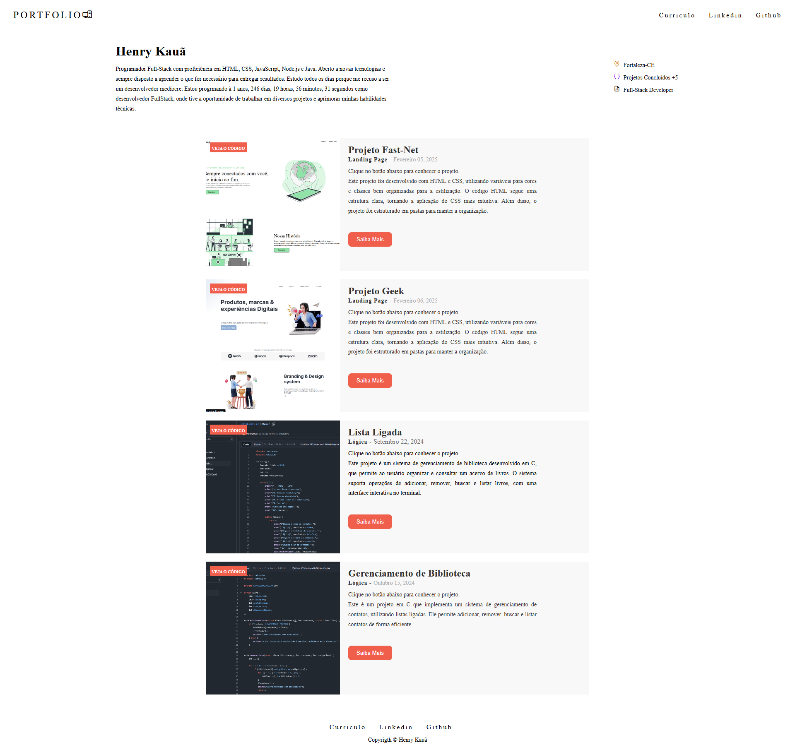

# Projeto: Site Pessoal (Portfolio)

## Descrição do Projeto
Este é um projeto HTML e CSS de portfolio onde contem uma breve descrição sobre mim e projetos que construi até o momento.

 - Utilizei variáveis para cores
 - Utilizei classes para estilização no CSS
 - HTML foi bem organizado e classes são de fácil entedimento para estilizações no CSS
 - Estruturei o projeto em pastas
 ```
|-src
    |-assets
        |- imagens-usadas
        ...
    |- styles
        ...
    |- script
        index.js
|- index.html
|- README.md
```



## Como Executar o Projeto

1. Clone ou baixe o repositório.
   ```bash
   git clone https://github.com/henrymzs/personal-website.git
   ```

2. Navegue até a pasta do projeto.
   ```bash
   cd nome-do-repositorio
   ```

3. Abra o arquivo `index.html` no navegador com a extensão do vscode (live server).

---